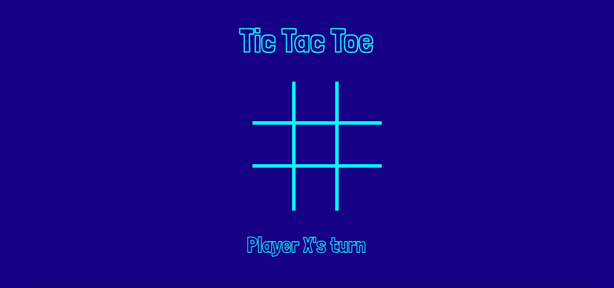
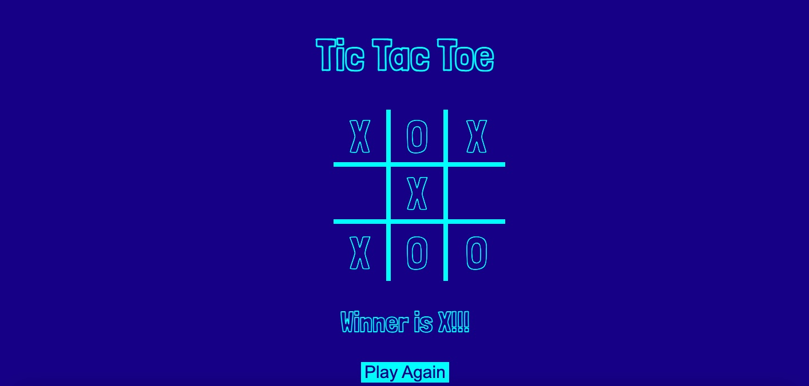

# Tornado

## Date: 6/26/2022

### By: Emily Byrne

#### [LinkedIn](https://www.linkedin.com/in/emilybyrne3/) | [GitHub](https://github.com/embyrne13) | [Game Website](https://tictactoeblue.surge.sh/)

---

### **_Description_**

#### This is a game I made in a weekend for General Assembly. The game is standard Tic Tac Toe. One would need 2 players to play. This is my first project using HTML, CSS, and JavaScript.

---

### **_Technologies_**

- HTML
- CSS
- Javascript
- GitHub
- VSCode
- Google Fonts

---

### **_Overview_**

---

The name of the game is Tic Tac Toe. One player is X and one player is O. You are hoping to get 3 in a row to win. The player who is able to get 3 in a row first wins.

### **_Screenshots_**

---

### **_Future Updates_**

- [x] Create board
- [x] Display whose turn it is
- [x] Create players X and O
- [x] Style with CSS
- [x] Setup win screen
- [x] New game button

---

### **_Future Developments_**

- Computer AI
- Timer
- Scoreboard
